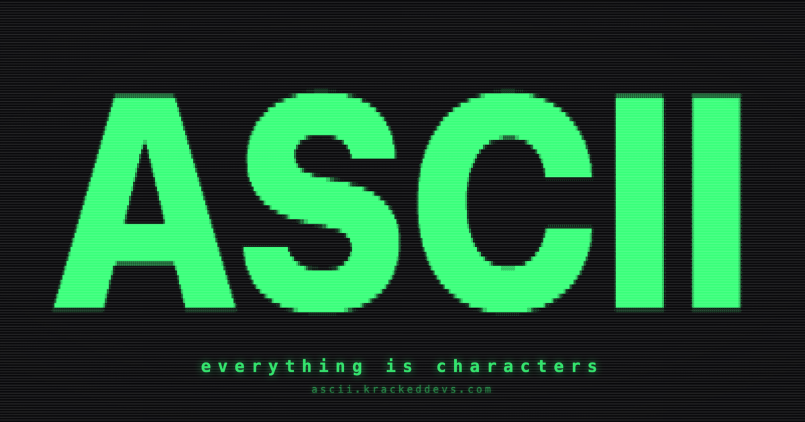

<div align="center">



# ASCII

**Everything is characters.** A text-native generative art instrument: 12 engines,
three modes, any charset, exported as text, ANSI, SVG, PNG or video.
One HTML file, zero dependencies, runs from `file://`.

[](LICENSE)
&nbsp;[](https://ascii.krackeddevs.com)
&nbsp;[](https://github.com/enonforetsam/ascii/actions/workflows/test.yml)
&nbsp;[](#quick-start)

[Studio](https://ascii.krackeddevs.com) ·
[Engines](docs/ENGINES.md) ·
Sibling: [Fluid](https://github.com/enonforetsam/fluid) (the pixel one)

</div>

## Quick start

```sh
git clone https://github.com/enonforetsam/ascii
open ascii/index.html
```

That is the whole instrument. For the Worker (security headers, previews):

```sh
npm run dev        # wrangler dev, http://localhost:8787
npm test           # smoke tests, no dependencies
```

## Why characters

Where [Fluid](https://github.com/enonforetsam/fluid) renders pixels with WebGL, ASCII keeps a
`cols × rows` grid of `{intensity, glyph}` as the source of truth and draws it from a
pre-baked glyph atlas. That unlocks things a pixel renderer cannot do:

- **Copy the live frame as text** and paste it anywhere a monospace font lives.
- **Export `.txt` and `.ans`** (ANSI colour) for terminals, READMEs and BBS nostalgia,
  plus SVG, PNG and WebM.
- **Braille detail from photos**: eight dots per cell, four times the resolution of a
  character ramp.
- **Words mode**: type a sentence, watch the engines flow through the letters.
- **Any charset**: standard, blocks, braille, or your own string ordered dark → light.

## Engines

`donut` · `cube` · `sphere` · `knot` · `pyramid` · `matrix` · `plasma` · `life` ·
`fire` · `flow` · `stars` · `tunnel`

The 3D solids tilt with the pointer. Every engine is a small module that fills the
character buffer once per frame; [docs/ENGINES.md](docs/ENGINES.md) shows how to add one
in about 30 lines, with no WebGL involved. `image` and `words` are modes of their own.

## Looks and share links

A **look** is a preset: engine, charset, palette, cell size, contrast. Every state is a
share link (`#p=…`, append-only) that the Worker mirrors for link previews. Shuffle
generates a new look, reseeding every engine.

## What is open, what is hosted

Everything in this repo. ascii.krackeddevs.com serves the same `index.html` behind a
Cloudflare Worker that adds security headers and Open Graph previews; there is no
backend, no account and no upload. The only third-party request is Cloudflare Web
Analytics.

## Deploy your own

```sh
npx wrangler deploy --env staging     # then promote
npx wrangler deploy
```

`wrangler.jsonc` names the routes; `.assetsignore` keeps the Worker, tests and config
out of the published files.

## Contributing

New engines, charsets and looks are the easiest contributions. Read
[CONTRIBUTING.md](CONTRIBUTING.md) and [docs/ENGINES.md](docs/ENGINES.md).

## License

MIT © KrackedDevs
